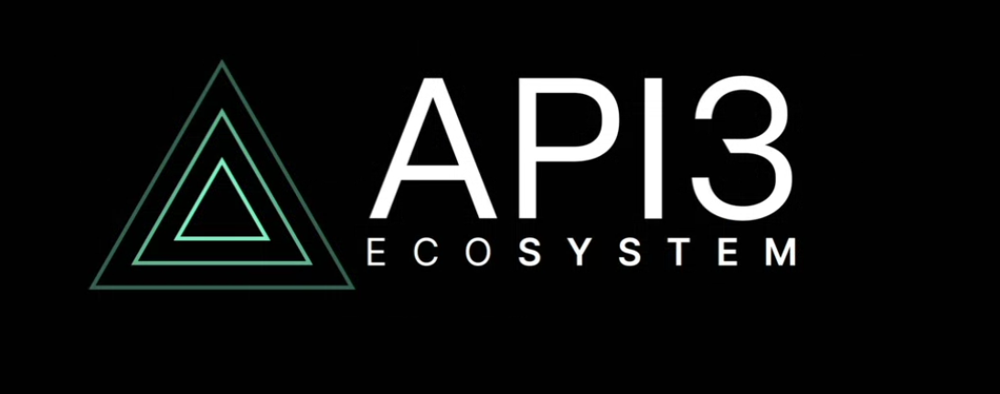

## API3 Ecosystem

[API3](api3.org/) is building the next-gen first-party oracles that are operated directly by the API Providers. API3 Ecosystem is a sub-team within the API3 DAO that is responsible for building the infrastructure that enables the API3 developer ecosystem to thrive.

[API3 Ecosystem Website](ecosystem.api3.org/)

[API3 Documentation](https://docs.api3.org/)